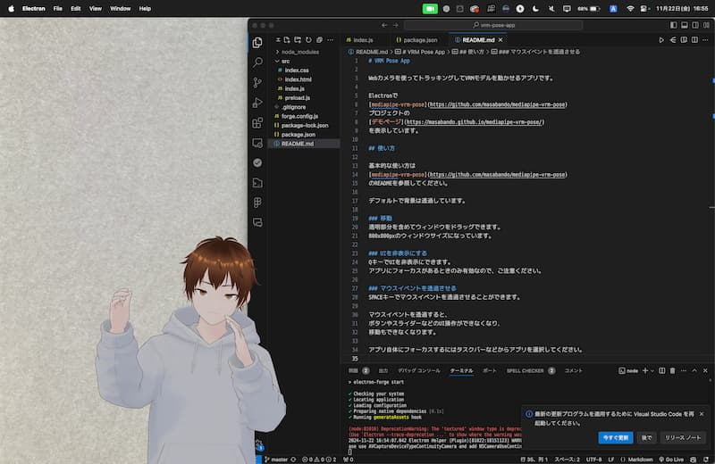

# VRM Pose App



Webカメラを使ってトラッキングしてVRMモデルを動かせるアプリです。

Electronで
[mediapipe-vrm-pose](https://github.com/masabando/mediapipe-vrm-pose)
プロジェクトの
[デモページ](https://masabando.github.io/mediapipe-vrm-pose/)
を表示しています。

## ダウンロード
* [Windows x64](https://alice.helixcode.net/~bando/pub/vrm-pose-app-1.0.0_Setup.exe)
* [Mac (Apple Silicon) (to be released)]()

## 必要なもの
- インターネット環境
- そこそこのスペックのPC
- Webカメラ

姿勢・顔・手の認識をしているため、それなりの負荷がかかります。

通信は
- ページ
- 初期VRMモデル
- MediaPipeの一部

のみで発生するため、動き出したあとはインターネットに接続されている必要はありません。

## 使い方

基本的な使い方は
[mediapipe-vrm-pose](https://github.com/masabando/mediapipe-vrm-pose)
のREADMEを参照してください。

デフォルトで背景は透過しています。

### 移動
透明部分を含めてウィンドウをドラッグできます。  
800x800pxのウィンドウサイズになっています。

### UIを非表示にする
`Q`キーでUIを非表示にできます。  
アプリにフォーカスがあるときのみ有効なので、ご注意ください。

### マウスイベントを透過させる
`SPACE`キーでマウスイベントを透過させることができます。

マウスイベントを透過すると、
ボタンやスライダーなどのUI操作ができなくなり、
移動もできなくなります。

アプリ自体にフォーカスするにはタスクバーなどからアプリを選択してください。

## Macでの利用 (or Windowsでうまく動かない場合)
開発環境で動かしてください。

この場合、 node.js のインストールが必要です。

### 準備
1. コードをダウンロードして、zipを展開してからそのフォルダをコマンドプロンプトで開きます。
2. 以下のコマンドで必要なものをインストールします。
   ```bash
   npm install
   ```
   インストール作業は1回だけすれば十分です。

### 実行
以下のコマンドで実行します。
```
npm start
```
